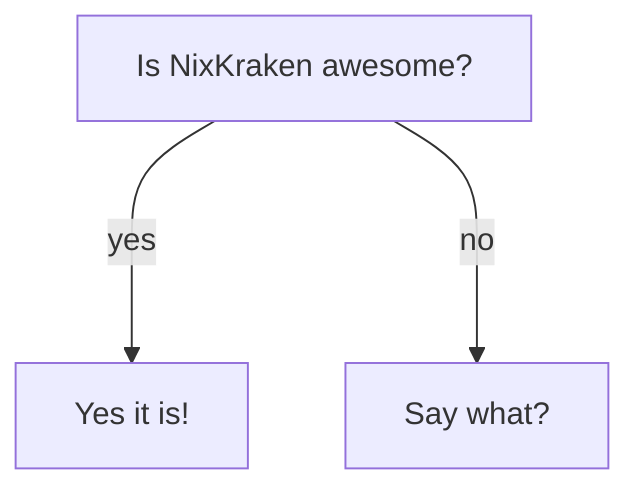

[apastyle]: https://apastyle.apa.org/style-grammar-guidelines/capitalization/title-case
[doc-devshell]: ./contributing.md#nix-development-shell
[doc-pkgs]: ./pkgs/intro.md
[fa]: https://fontawesome.com
[hm-nixos-opt]: https://nix-community.github.io/home-manager/nixos-options.xhtml
[hm-opt]: https://nix-community.github.io/home-manager/options.xhtml
[hm]: https://nix-community.github.io/home-manager/index.xhtml
[loc-customization]: #customization
[loc-gen-content]: #generated-content
[loc-json-representation]: #providing-json-module-options-representation
[loc-opts-builder]: #options-documentation-builder
[mdguide-heading-link]: https://www.markdownguide.org/extended-syntax/#linking-to-heading-ids
[mdguide-ref-links]: https://www.markdownguide.org/basic-syntax/#reference-style-links
[mdguide-syntax-highlight]: https://www.markdownguide.org/extended-syntax/#syntax-highlighting
[mdit-figures]: https://github.com/arve0/markdown-it-implicit-figures
[mdit]: https://markdown-it.github.io/markdown-it
[mermaid]: https://mermaid.js.org
[nix-manual-drv]: https://nix.dev/manual/nix/stable/language/derivations.html
[nix-manual]: https://nix.dev/manual/nix/stable
[nixdev]: https://nix.dev
[nixos-manual-module-opts]: https://nixos.org/manual/nixos/stable/#sec-option-declarations
[nixos-manual]: https://nixos.org/manual/nixos/stable
[nixos-wiki]: https://wiki.nixos.org/wiki/
[nixpkgs-manual-buildnpmpkg]: https://nixos.org/manual/nixpkgs/stable/#javascript-buildNpmPackage
[nixpkgs-manual-evalmodules]: https://nixos.org/manual/nixpkgs/stable/#module-system-lib-evalModules
[nixpkgs-manual-substituteinplace]: https://nixos.org/manual/nixpkgs/stable/#fun-substituteInPlace
[nixpkgs-manual]: https://nixos.org/manual/nixpkgs/stable
[nixpkgs-mk-opts-doc]: https://github.com/NixOS/nixpkgs/blob/02071814abd873bc55202fe0fd3d8de89225050a/nixos/lib/make-options-doc/default.nix
[nodejs]: https://nodejs.org
[repo-action-deploy]: https://github.com/nicolas-goudry/nixkraken/blob/main/.github/workflows/deploy-docs.yml
[repo-docs-drv]: https://github.com/nicolas-goudry/nixkraken/blob/main/docs/default.nix
[repo-docs-root]: https://github.com/nicolas-goudry/nixkraken/blob/main/docs
[repo-generate-docs-script]: https://github.com/nicolas-goudry/nixkraken/blob/main/docs/generate_docs.py
[repo-gitkraken-versions]: https://github.com/nicolas-goudry/nixkraken/blob/main/gitkraken/versions.nix
[repo-main-css]: https://github.com/nicolas-goudry/nixkraken/blob/main/docs/.vitepress/theme/styles.css
[repo-themes]: https://github.com/nicolas-goudry/nixkraken/blob/main/themes
[styling-kbd]: https://dylanatsmith.com/wrote/styling-the-kbd-element
[vitepress-containers]: https://vitepress.dev/guide/markdown#custom-containers
[vitepress-md-opt]: https://vitepress.dev/reference/site-config#markdown
[vitepress-mermaid-gh-discussion]: https://github.com/vuejs/vitepress/discussions/4999
[vitepress-reference]: https://vitepress.dev/reference/site-config
[vitepress]: https://vitepress.dev

# Documentation

> _« A documentation about the documentation inside the documentation. »_

This guide, aimed at contributors working on NixKraken documentation, explains how it is structured and built.

## Overview

The documentation is using [VitePress][vitepress] to generate a static website from the Markdown content located inside the [`docs` directory][repo-docs-root]. Its canonical build path uses a [Nix derivation][nix-manual-drv].

A GitHub Actions workflow, available at [`.github/workflows/deploy-docs.yml`][repo-action-deploy], builds and deploys the website to GitHub Pages.

The `docs` directory defines several files and directories, each with unique responsibilities:

```txt
.
├── .vitepress         # VitePress theme and config
├── @types             # TypeScript types declarations
├── patches            # NPM package patches
├── src                # Markdown content
├── default.nix        # Nix build derivation
├── generate_docs.py   # Reference pages builder
├── options-json.nix   # Module options evaluator
├── package.json       # NPM package configuration
└── package-lock.json  # NPM package lockfile
```

::: info

All paths and commands referenced in the rest of this document are relative to the `docs` directory, unless stated otherwise.

:::

## Local Development

### Prerequisites

For local development, [NodeJS][nodejs] is required to run VitePress. You can either install it globally, or use the provided [Nix development shell][doc-devshell].

Once NodeJS is installed, the `npm` command should be available. Use it to install VitePress and the dependencies required by the documentation:

```sh
$ npm install
```

### Running

To serve the documentation website locally, for development purposes, run the following command:

```sh
$ npm run dev
```

The documentation will be served at `http://localhost:5173`.

Any change to documentation files will trigger a live or full reload, depending on the content changed.

### Building

To build the documentation, run the following command:

```sh
$ npm run build
```

The documentation will be built in the `.vitepress/dist` directory.

## Content Authoring

### Structure

The documentation pages are generated from Markdown files located in the `src` directory.

Each of these files is built as a single HTML page and is served at the same URL location as its location in the filesystem, relative to the `src` directory.

::: tip EXAMPLE

A file stored in `src/foo/bar.md` would be served from `/foo/bar`.

:::

To further organize documentation content and improve navigation, we use three distinct categories of documentation:

- **Guide**: installation instructions and how-tos aimed, primarily aimed at users
- **Reference**: module options reference, aimed at end-users and contributors
- **Contribute**: explanations about various aspects of the project, aimed at contributors

These categories are shown in the documentation navigation bar and are separated in different directories:

```txt
src
├── contrib    # Contributors documentation
├── guide      # User guides
└── reference  # Options documentation
```

#### Generated Content

Throughout the documentation, there are multiple special markers which are used to generate content at build time. This process avoids manual maintenance of documentation directly originating from code, effectively avoiding update omissions.

Here is a list of currently used markers:

| Marker               | Location                    | Replacement                     |
| -------------------- | --------------------------- | ------------------------------- |
| `CACHED_COMMIT_LIST` | `src/guide/user/caching.md` | List of nixpkgs cached commits  |
| `GK_<pkg>_USAGE`     | `src/contrib/pkgs`          | Usage output of `<pkg>` command |
| `THEMES_LIST`        | `src/guide/user/theming.md` | List of bundled themes          |

Additionally, most files located in the `reference` directory are automatically generated from NixKraken module's evaluated options. Identifying them is easy since they include a header with an explicit warning message:

```yaml
---
# This file is automatically generated. DO NOT EDIT MANUALLY.
---
```

These files are generated through CI, whenever there is a change in the repository.

::: tip

For further details on this generation process, refer to the specific section about the [options documentation builder][loc-opts-builder].

:::

### Conventions

We try to follow the conventions below to keep the documentation homogenous, digestable-_(ish)_ and maintainable, while being the most complete possible:

- use [APA-style][apastyle] headings casing
- avoid use of contractions
  - this is valid: `it is`
  - this is not: `it's`
- use [reference-style Markdown links][mdguide-ref-links]
  - this is valid: `[some link][link-ref]`
  - this is not: `[some link](https://example.org)`
- store link references at the top of Markdown files

  ```md
  [link-ref]: https://example.org
  ```

- keep the list of link references alphabetically ordered
- link to official stable documentations when relevant
- use a consistent naming for link references

  | Documentation                                        | Naming pattern             |
  | ---------------------------------------------------- | -------------------------- |
  | [Nix reference][nix-manual]                          | `[nix-manual<-topic?>]`    |
  | [NixOS reference][nixos-manual]                      | `[nixos-manual<-topic?>]`  |
  | [NixOS wiki][nixos-wiki]                             | `[nixos-wiki<-topic?>]`    |
  | [nixpkgs reference][nixpkgs-manual]                  | `[nixpkgs-manual<-topic?]` |
  | [Home Manager reference][hm]                         | `[hm<-topic?>]`            |
  | [Home Manager options reference][hm-opt]             | `[hm-opt<-option?>]`       |
  | [Home Manager NixOS options reference][hm-nixos-opt] | `[hm-nixos-opt<-option?>]` |
  | [Nix tutorials and guides][nixdev]                   | `[nixdev<-topic?>]`        |

- when [linking to heading IDs][mdguide-heading-link], start the link reference with `loc-`
- when linking to other documentation pages, start the link reference with `doc-`
- do not be shy on cross-reference links

### Alerts and Callouts

[VitePress supports custom containers][vitepress-containers], which can be used to render alerts/callouts throughout the documentation.

We customized them a bit by adding a [FontAwesome][fa] icon before the title, using some CSS. See the [VitePress customization section][loc-customization] for further details.

```md
::: info
Useful information that users should know, even when skimming content.
:::

::: tip
Helpful advice for doing things better or more easily.
:::

::: warning
Urgent info that needs immediate user attention to avoid problems.
:::

::: danger
Advises about risks or negative outcomes of certain actions.
:::
```

::: info

Useful information that users should know, even when skimming content.

:::

::: tip

Helpful advice for doing things better or more easily.

:::

::: warning

Urgent info that needs immediate user attention to avoid problems.

:::

::: danger

Advises about risks or negative outcomes of certain actions.

:::

### Images and Assets

If there is a need to use images and/or assets, they should be added in a directory called `assets` and located at the same level as their consumer. For example, if an image is needed in the `src/contrib/docs.md` file, the source images should be stored in the `src/contrib/assets` directory.

Additional assets, like CSS or JavaScript files, should be stored in the `.vitepress/theme` directory. This is further covered in the [VitePress customization section][loc-customization].

## VitePress Specifics

::: info

We use VitePress alpha version 2.

:::

### Configuration

VitePress configuration is split in two locations:

- `src/config.ts`: "content" configuration like sidebars, navigation bar, footer, etc.
- `.vitepress/config.mts`: behavior configuration like site config, markdown plugins, search provider, etc.

This setup is replicating VitePress' own way of dealing with configuration for their documentation.

::: tip

See the [official VitePress reference][vitepress-reference] for further details about configuration options and behavior.

:::

### Customization

VitePress allows to customize the default theme through the `.vitepress/theme/index.ts` file, from which other files can be imported to further customize VitePress look and feel.

Additionally, VitePress allows to customize Markdown parsing process, through the [`markdown` site config option][vitepress-md-opt] and [markdown-it][mdit] plugins.

The documentation takes advantage of these to introduce several custom behaviors, which are detailed in the following sections.

#### Custom CSS

Some [minor CSS customizations][repo-main-css] are brought, although the main ones are:

- home page customizations (title and feature icons color, logo shadow)
- custom `<kbd>` HTML tag rendering, based on [this blog post][styling-kbd]
- automatic FontAwesome icon on callouts

#### Figure captions

This feature is implemented with the [markdown-it-implicit-figures plugin][mdit-figures], which renders images as `<figure>` HTML tags with a `<figcaption>`.

There is no bundled CSS styling, so we added automatically numbered and centered figure captions.

Example:

```md

```


#### Mermaid.js Support

[Mermaid.js][mermaid] is a JavaScript library that renders diagrams from markdown-like text. This documentation uses Mermaid to illustrate NixKraken concepts.

To add a Mermaid diagram to the documentation, use a [fenced code block with the `mermaid` syntax][mdguide-syntax-highlight]:

```mmd
flowchart TD
  start["Is NixKraken awesome?"]
  yes["Yes it is!"]
  what["Say what?"]

  start --->|yes| yes
  start --->|no| what
```

Which renders:



By default, VitePress does not support Mermaid diagrams rendering. There are a few solutions available in the wild, but none were good enough, so we implemented a custom solution based only on the official library.

This is further detailed in the following [discussion on VitePress' GitHub][vitepress-mermaid-gh-discussion].

## Options Documentation Builder

Thanks to the self-describing nature of [NixOS module options][nixos-manual-module-opts], we can leverage this information to auto-generate reference documentation for module options.

This is the role of the [`generate_docs.py` script][repo-generate-docs-script], which automatically creates Markdown documentation files from a [JSON representation of NixKraken module options][loc-json-representation].

The script reads this JSON file from command-line arguments to:

- process and categorize options into "groups" matching known submodules (like `datetime`, `git`, `gpg`, `profiles`, etc.)
- convert each option's metadata (`description`, `type`, `default` value, `examples`) into formatted Markdown documentation

The grouping logic uses string prefix matching to determine which category each option belongs to, with special handling for nested `profiles` options and a fallback `root` group for ungrouped items.

For each group, the script generates a separate Markdown file in an organized directory structure, with special handling of profile-specific options (matching the pattern `profiles.*.*`) which are placed in a `profiles` subdirectory.

Each generated file includes formatted sections for each option with its:

- name
- description
- scope (profile-specific or global option)
- type information
- valid values extracted from type information, if any
- default value
- optional example

### Running

Although the builder script is meant to be run from CI, it can be useful to run it whenever it gets updated or when module options documentation changes.

To run it, we first need to generate the module options JSON representation:

```sh
# Using new Nix commands
$ nix build -f docs/options-json.nix
```

```sh
# ...or classic Nix commands
$ nix-build -f docs/options-json.nix
```

This command will generate an `options.json` file in the `result` directory, which we can use as input to the builder script:

```sh
$ ./docs/generate_docs.py result/options.json docs/src/reference
```

::: info

`docs/src/reference` is the output directory.

:::

## Nix Derivation

The Nix derivation, located in the [`default.nix` file][repo-docs-drv], is the canonical way to build and package the documentation. It uses the [`buildNpmPackage` builder][nixpkgs-manual-buildnpmpkg].

At its core, this derivation is responsible for generating and providing all the necessary content to build the final documentation from the `docs` source directory, which can then be deployed to a hosting service or served locally.

To build it, use the following command:

```sh
# Using new Nix commands
$ nix build '.#docs'
```

```sh
# ...or classic Nix commands
$ nix-build ./docs
```

::: tip

If using classic Nix commands, make sure to use at least nixpkgs 25.05:

```sh
$ nix-build ./docs -I nixpkgs=https://github.com/nixos/nixpkgs/archive/nixos-25.05.tar.gz
```

:::

### Providing JSON Module Options Representation

Since the [options documentation builder][loc-opts-builder] needs to be provided with a JSON representation of the module options in order to generate the reference documentation, the Nix derivation:

- loosely evaluates (`config._module.check = false`) the actual module code using [`lib.evalModules`][nixpkgs-manual-evalmodules]
- pass the evaluated module `options` attributes to [`nixosOptionsDoc`][nixpkgs-mk-opts-doc] which generates, among other formats, a JSON representation of the module options

This JSON representation is then passed down to the options documentation builder to actually generate the reference documentation for module options.

For debugging purposes, here is how to generate the module options JSON representation:

```sh
# Using new Nix commands
$ nix build -f options-json.nix
```

```sh
# ...or classic Nix commands
$ nix-build options-json.nix
```

Once run, the JSON options file will be located in `result/options.json`.

### Replacing Special Markers

As mentioned in the [generated content section][loc-gen-content], several markers are consumed by this derivation to generate dynamic documentation content, using the [`substituteInPlace` utility function][nixpkgs-manual-substituteinplace]:

- the `CACHED_COMMIT_LIST` marker is replaced by a Markdown list generated from the [GitKraken cached versions][repo-gitkraken-versions]
- the `GK_<pkg>_USAGE` markers are replaced by running [helper packages][doc-pkgs] with the `--help` flag and using the output as replacement
- the `THEMES_LIST` marker is replaced by a Markdown table describing all [bundled themes][repo-themes]
