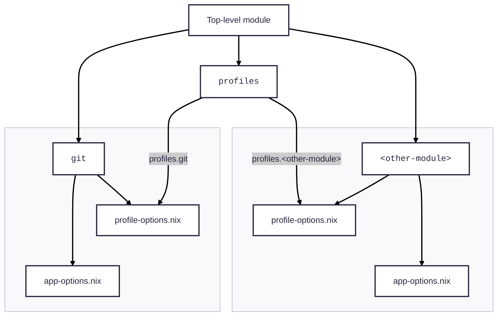
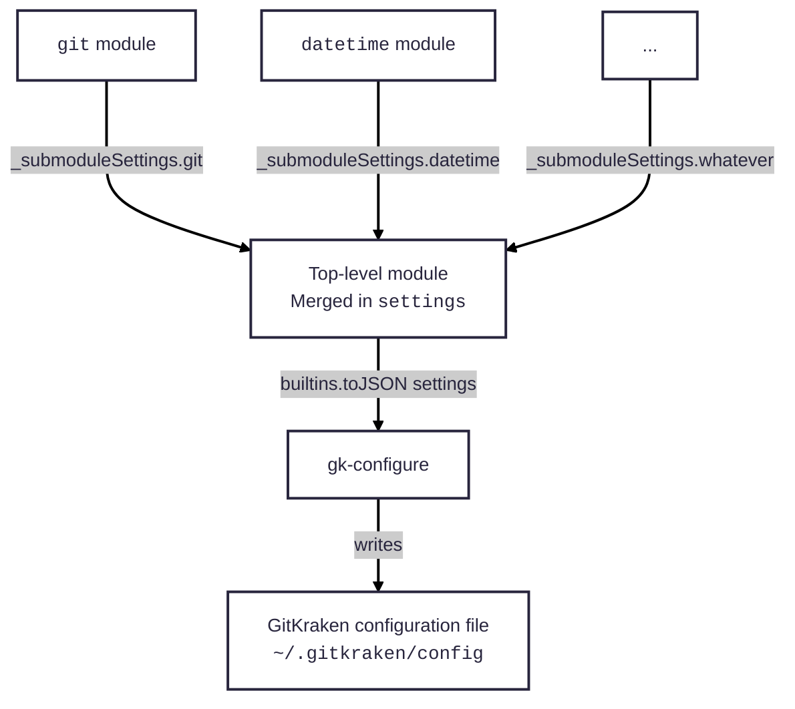
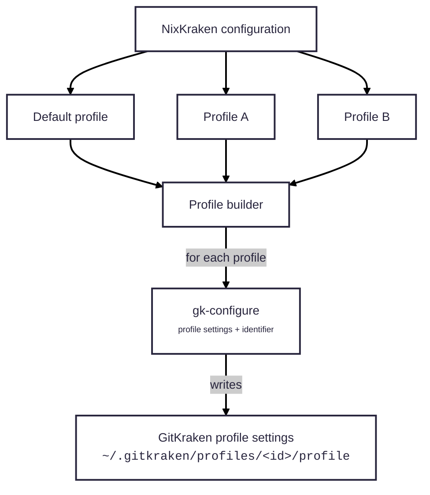

[doc-pkg-configure]: ./packages/configure.md
[doc-pkg-theme]: ./packages/theme.md
[gitkraken]: https://www.gitkraken.com/git-client
[hm]: https://nix-community.github.io/home-manager/index.xhtml
[loc-composition]: #settings-composition
[loc-profiles]: #profiles-module
[loc-safeguards]: #safeguards
[nix-manual-attrs]: https://nix.dev/manual/nix/stable/language/syntax#attrs-literal
[nix-manual-language]: https://nix.dev/manual/nix/stable/language/index.html
[nixos-manual-modules]: https://nixos.org/manual/nixos/stable/#sec-writing-modules
[nixos-manual-submodule]: https://nixos.org/manual/nixos/stable/#section-option-types-submodule
[nixos-manual-warn-assert]: https://nixos.org/manual/nixos/stable/#sec-assertions
[nixpkgs-manual-recupdate]: https://nixos.org/manual/nixpkgs/stable/#function-library-lib.attrsets.recursiveUpdate
[repo-genuuid]: https://github.com/nicolas-goudry/nixkraken/blob/main/modules/profiles/utils/uuid.nix
[repo-git-module]: https://github.com/nicolas-goudry/nixkraken/blob/main/modules/git
[repo-module]: https://github.com/nicolas-goudry/nixkraken/blob/main/module.nix
[repo-modules-root]: https://github.com/nicolas-goudry/nixkraken/blob/main/modules
[repo-opt-root]: https://github.com/nicolas-goudry/nixkraken/blob/main/modules/root-options.nix
[repo-profile-builder]: https://github.com/nicolas-goudry/nixkraken/blob/main/modules/profiles/utils/profile-builder.nix
[repo-profiles-module]: https://github.com/nicolas-goudry/nixkraken/blob/main/modules/profiles/default.nix
[wikipedia-uuid]: https://en.wikipedia.org/wiki/Universally_unique_identifier

# Modules

Modules are the core of NixKraken. Together, they form a declarative system that generates [GitKraken][gitkraken] configuration.

This document explains NixKraken's module organization, how modules compose into the final configuration, and module-specific behaviors. It is intended for contributors extending NixKraken or integrating custom behavior.

> [!IMPORTANT]
>
> **Contributors should be familiar with the [NixOS module system][nixos-manual-modules].**
>
> Terminology used in this document:
>
> - **options**: NixKraken module options (input)
> - **settings**: GitKraken configuration options (output)
> - **module** / **submodule**: NixKraken modules; "submodule" as defined by the NixOS module system

## Structure and organization

Each subdirectory within the [`modules` directory][repo-modules-root] implements a focused, single-purpose module for a specific aspect of GitKraken configuration.

Directory structure of the module system:

```txt
.
├── modules
│   ├── datetime
│   ├── git
│   ├── gpg
│   ├── graph
│   ├── notifications
│   ├── profiles
│   ├── ssh
│   ├── tools
│   ├── ui
│   ├── user
│   └── root-options.nix
└── module.nix
```

The primary entry point is [`module.nix`][repo-module]. It is responsible for:

- importing all [submodules][nixos-manual-submodule] from within the `modules` directory
- merging [composed settings][loc-composition] into the final GitKraken configuration
- defining [Home Manager][hm] configuration to install and configure GitKraken, leveraging the [`gk-configure`][doc-pkg-configure] and [`gk-theme`][doc-pkg-theme] packages

The [`root-options.nix` file][repo-opt-root] defines top-level options.

This modular approach improves maintainability and clarifies how configuration aspects interact.

## Option scoping

Most GitKraken settings are profile-specific; some are global. To support both scopes, a module may define:

- `app-options.nix`: global (application-wide) options
- `profile-options.nix`: profile-specific options

> [!NOTE]
>
> The [`profiles` module][loc-profiles] is an intentional exception to this pattern. It aggregates per-profile options across modules and constructs additional profile instances.

This design lets you define global and default-profile behavior in top-level modules (eg. `nixkraken.gpg`, `nixkraken.user`, etc.) and reuse per-profile options for additional profiles under `nixkraken.profiles.*`.

Example structure of the [`git` module][repo-git-module]:

```txt
modules/git
├── app-options.nix
├── default.nix
└── profile-options.nix
```

- `app-options.nix` declares global options
- `profile-options.nix` declares per-profile options
- `default.nix` defines:
  - the `git` [submodule][nixos-manual-submodule], including both global and per-profile options
  - the GitKraken settings produced for [composition][loc-composition]
  - the [Home Manager][hm] configuration

This structure is especially useful with the `profiles` module, which aggregates all per-profile options into a meta-module to define additional profiles. The following diagram illustrate this:



> [!NOTE]
>
> Some modules (eg. the `ui` module) split options across multiple files for maintainability due to the large number of options.
>
> They still adhere to the global vs. profile option boundaries via `app-options.nix` and `profile-options.nix`.
>
> This may evolve into nested submodules.

## Settings composition

To centralize application of GitKraken configuration, each submodule writes its evaluated global settings as an [attribute set][nix-manual-attrs] to an internal option `_submoduleSettings.<moduleName>`.

The top-level module merges all entries in `_submoduleSettings` to form the final GitKraken configuration and serializes it to JSON before passing it to the [`gk-configure` package][doc-pkg-configure], which writes to the location expected by GitKraken (ie. `~/.gitkraken/config`).

The following diagram illustrates the flow:



## Profiles module

As noted earlier, most GitKraken settings are per-profile. The [`profiles` module][repo-profiles-module] manages both the default profile and additional profiles.

The default profile is identified via an internal option `isDefault`. It uses GitKraken’s fixed identifier and sources its name and avatar from the root options `defaultProfile.name` and `defaultProfile.icon`.

> [!NOTE]
>
> **About profile identifiers**
>
> GitKraken uses [UUIDs][wikipedia-uuid] stripped of dashes to identify profiles. The default profile uses a fixed identifier (`d6e5a8ca26e14325a4275fc33b17e16f`), while additional profiles use randomly generated identifiers.
>
> Because [Nix][nix-manual-language] does not natively generate UUIDs, NixKraken derives stable, UUID-shaped identifiers via a [utility function][repo-genuuid] that:
>
> - takes a seed string as input
> - hashes the seed using the SHA-512 algorithm
> - slices the hash into five segments matching UUID lengths (8, 4, 4, 4, 12)
> - concatenates the segments with dashes
>
> This produces deterministic identifiers for profiles with unique names. Although we could hash the profile name and truncate to 32 characters, we use this function because it is also needed elsewhere.
>
> A [safeguard][loc-safeguards] prevents duplicate profile names, ensuring uniqueness of identifiers.

Because NixKraken supports multiple profiles, a [builder function][repo-profile-builder] emits GitKraken settings for each profile.

As with global settings, per-profile settings are serialized to JSON and passed, with the profile identifier, to the [`gk-configure` package][doc-pkg-configure], which writes them to `~/.gitkraken/profiles/<id>/profile`.

The following diagram illustrates the flow:



### Inheritance

Additional profiles inherit recursively from the default profile via [`lib.recursiveUpdate` function][nixpkgs-manual-recupdate]. Per-profile options override inherited defaults where keys overlap.

## Safeguards

To improve the user experience and catch issues early, NixKraken modules make extensive use of [warnings and assertions][nixos-manual-warn-assert].

Examples of safeguards:

- enabling commit/tag signing without a signing key
- enabling notification topics while notifications are disabled
- mutually exclusive options such as package and version

Use an assertion when a configuration would be invalid or non-deterministic. Use a warning for configurations that are valid but likely unintended.

Messages should be informative and cite the relevant options.

Example (good):

> SSH keys (`ssh.privateKey`, `ssh.publicKey`) cannot be set when local SSH agent is used (`ssh.useLocalAgent`)

As opposed to:

> Cannot set `ssh.privateKey`
